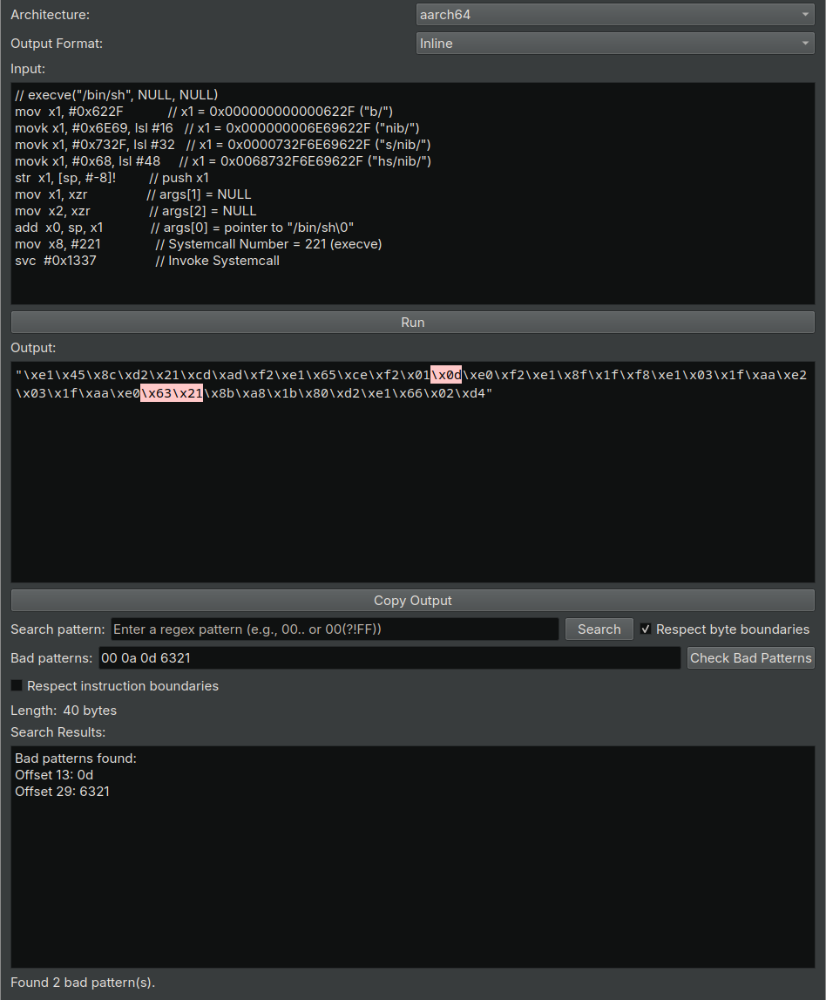

# BinaryNinja Shellcoder Plugin

## Overview

Shellcoder is a lightweight plugin for Binary Ninja that enhances shellcode development and analysis.
It provides a versatile interface for assembling, disassembling, and formatting shellcode, supporting multiple architectures and output formats akin to the online ShellStorm Assembler/Disassembler.

## Features

- **Multi-architecture Support**: Compatible with all architectures supported by Binary Ninja.
- **Flexible Input Formats**:
  - Assembly instructions
  - Inline hex format (e.g., "\x90\x90")
  - Space-separated hex format (e.g., 90 90)
- **Multiple Output Formats**:
  - Inline hex
  - Space-separated hex
  - Python byte string
  - C-style array
  - Disassembled mnemonics (for disassembling)
- **Customizable Mnemonic Display**:
  - Optional address display
  - Optional bytecode display
  - Adjustable base address for relative operations
- **Comment usage**:
  - You can annotate your assembly/shellcode with comments (`#`, `//`, or `;`)
- **Bad Character Identification**: Quickly identify and highlight problematic bytes in your shellcode.
- **No External Dependencies**: Utilizes only Binary Ninja's built-in functionalities, ensuring a lightweight and easily deployable solution.

## Installation

1. Clone this repository or download the source code.
2. Copy the plugin file to your Binary Ninja plugins folder:
   - Windows: `%APPDATA%\Binary Ninja\plugins\`
   - Linux: `~/.binaryninja/plugins/`
   - macOS: `~/Library/Application Support/Binary Ninja/plugins/`
3. Restart Binary Ninja or reload plugins.

## Usage

1. Open Binary Ninja and navigate to the "Plugins" menu.
2. Select "Shellcoder" to open the plugin interface.
3. Enter your assembly code or hex-formatted shellcode in the input area.
4. Choose your desired output format and options.
5. Click "Assemble" to process your input.
6. View the results in the output area.

_Note_: Alternatively you can use `CTRL+p` to open the command palette and search for the plugin.

## Showcase

## Contributing

Contributions to the plugin are more than welcome! Here's how you can contribute:

1. Fork the repository.
2. Create a new branch for your feature or bug fix.
3. Commit your changes with clear, descriptive commit messages.
4. Push your branch and submit a pull request.

Please ensure your code adheres to the existing style and includes appropriate tests and documentation whenever necessary.

## License

This project is licensed under the Apache 2.0 License - see the [LICENSE](LICENSE) file for details.

## Acknowledgments

- The Binary Ninja team for their excellent reverse engineering platform.
- The ShellStorm online assembler/disassembler for giving me the idea.

## Contact

For bug reports, feature requests, or general inquiries, please open an issue on the GitHub repository.

---

Happy shellcoding!
